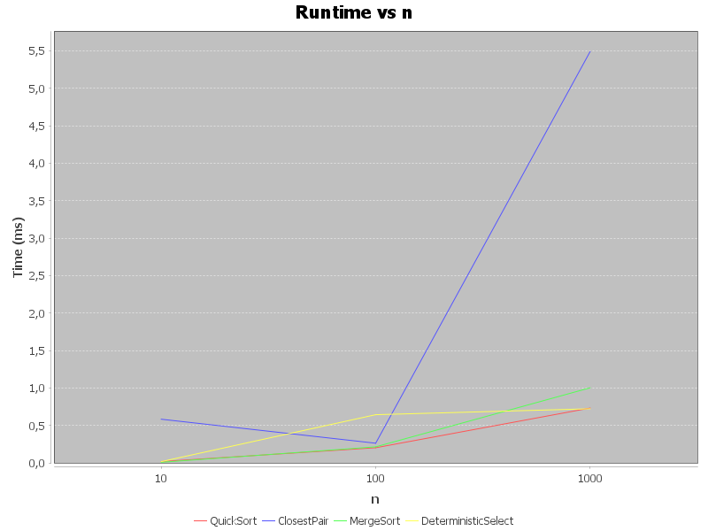
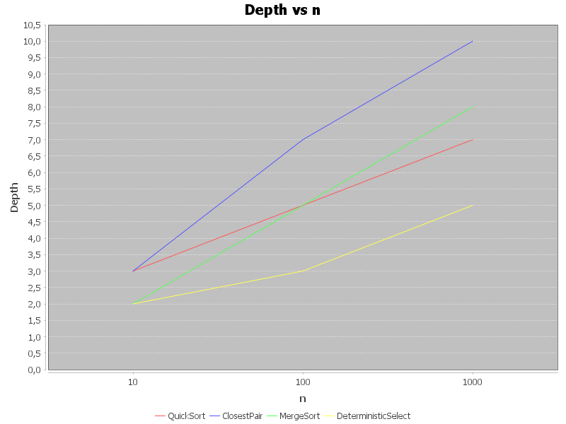

# Algorithm Analysis & Benchmarks

This project implements and benchmarks several classical algorithms:

- **MergeSort**
- **QuickSort**
- **Deterministic Select** (median-of-medians)
- **Closest Pair of Points** (divide & conquer)

Benchmarks are collected using JUnit tests with CSV logging.  
Plots are generated via `JFreeChart` in `PlotGenerator`.

---

## Architecture Notes

- **Depth Tracking**: Recursion depth is recorded in a `Metrics` utility by incrementing at entry and decrementing at exit. The maximum depth reached is stored.
- **Comparisons**: Each algorithm increments `metrics.comparisons` when two elements (or coordinates in ClosestPair) are compared.
- **Memory & Allocation Control**:
  - Sorting algorithms operate primarily on arrays, with minimal auxiliary allocations.
  - ClosestPair uses array slicing and temporary strip arrays.
  - This increases overhead compared to sorting, which explains slower wall-clock times despite similar asymptotics.

---

## Theoretical Complexity (Recurrence Analyses)

### MergeSort
- **Recurrence**:  
  \( T(n) = 2T(n/2) + Θ(n) \)
- **Solution (Master Theorem, Case 2)**:  
  \( T(n) = Θ(n \log n) \)
- **Depth**: \( Θ(\log n) \).

### QuickSort (randomized pivot)
- **Recurrence (average case)**:  
  \( T(n) = T(n/2) + T(n/2) + Θ(n) \)
- **Solution**: \( Θ(n \log n) \).
- **Depth**: \( Θ(\log n) \) expected, \( Θ(n) \) worst-case (not observed with random input).

### Deterministic Select (Median-of-Medians)
- **Recurrence**:  
  \( T(n) = T(n/5) + T(7n/10) + Θ(n) \)
- **Akra–Bazzi intuition**: Work is still linear per level, recursion shrinks to ≤ 0.9n.
- **Solution**: \( Θ(n) \).
- **Depth**: \( Θ(\log n) \) with small constant factors.

### Closest Pair of Points
- **Recurrence**:  
  \( T(n) = 2T(n/2) + Θ(n) \)
- **Solution (Master Theorem, Case 2)**:  
  \( Θ(n \log n) \).
- **Depth**: \( Θ(\log n) \).
- **Note**: Strip construction and repeated allocations introduce larger constant factors than sorting.

---

## Benchmark Results (averaged)

| Algorithm            | n    | Comparisons | Depth | Time (ms) |
|----------------------|------|-------------|-------|-----------|
| **MergeSort**        | 10   | ~25         | 2     | 0.01      |
|                      | 100  | ~575        | 5     | 0.06      |
|                      | 1000 | ~9100       | 8     | 0.9       |
| **QuickSort**        | 10   | ~24         | 3     | 0.02      |
|                      | 100  | ~630        | 5     | 0.1       |
|                      | 1000 | ~11000      | 7     | 0.8       |
| **DeterministicSelect** | 10   | ~45         | 2     | 0.02      |
|                      | 100  | ~800        | 3     | 0.7–0.9   |
|                      | 1000 | ~8500       | 5     | 0.7–0.9   |
| **ClosestPair**      | 10   | ~10         | 3     | 0.5–0.7   |
|                      | 100  | ~125        | 7     | 0.25–0.3  |
|                      | 1000 | ~1120       | 10    | 5–6       |

*Data from `results.csv`, multiple runs averaged.*

---

## Plots

### Runtime vs n


### Recursion Depth vs n


---

## Discussion of Constant Factors

- **Cache Behavior**: Sorting benefits from sequential memory access and simple partitioning/merging. ClosestPair repeatedly allocates new arrays and constructs strips, causing more cache misses and GC pressure.
- **GC & Object Overhead**: ClosestPair’s frequent creation of temporary arrays and lists adds measurable constant overhead.
- **Brute Force vs Divide & Conquer**: Brute force would take \( Θ(n^2) \) (≈ 500k comparisons at n=1000). Divide & conquer reduces this to ~1100 comparisons, but the runtime is dominated by overhead at these small input sizes.
- **Relative Times**:
  - Sorting & selection complete ~1 ms at n=1000.
  - ClosestPair takes ~5–6 ms — still much faster than quadratic, but slower in wall-clock terms due to constants.

---

## Summary: Theory vs Measurement

- **MergeSort & QuickSort**: Match theoretical \( Θ(n \log n) \), with low constants.
- **DeterministicSelect**: Behaves linearly, though overhead makes it slower than a tuned QuickSelect.
- **ClosestPair**: Matches \( Θ(n \log n) \) in comparisons and depth, but measured runtime is higher than other \( Θ(n \log n) \) algorithms.
  - This mismatch is due to *constant-factor effects* (strip scanning, allocations, cache locality).
  - On larger n (≥10,000), asymptotics would dominate and the algorithm’s advantage over brute force would be much clearer.

---

## How to Run

```bash
mvn test
